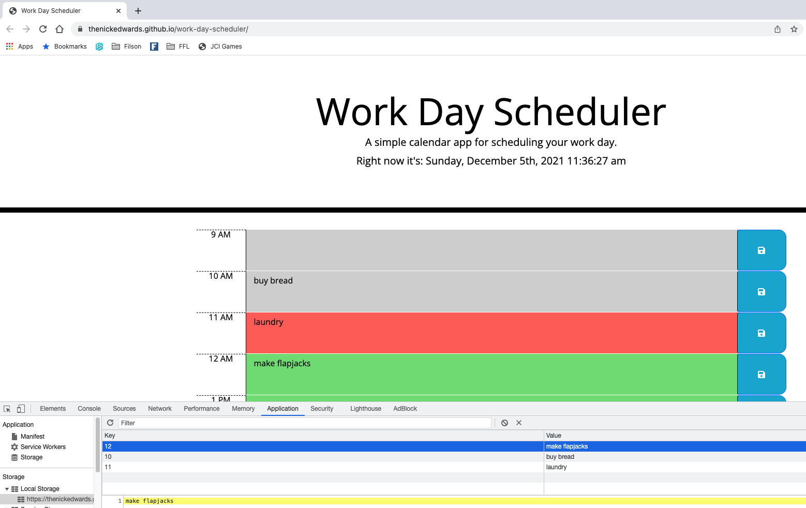

# work-day-scheduler
Homework 05 Third-Party APIs: Work Day Scheduler - Build Out Work Day Scheduler

 Code written per acceptance criteria listed in [W5-hw_readme.md](W5-hw_readme.md).

## Work Done
* Code (including jQuery and Moment library) written and live
* Current date/time displayed at top of page
* Timeblocks rendered for standard business hours
* Timeblocks color coded to indicate if in past, present, or future
* Events, tasks, todo's, etc. can be entered in any given timeblock
* Events, tasks, todo's, etc. stored in local storage when save button clicked
* Previously stored events, tasks, todo's, etc. persist when page is refreshed 

## Links
URL for published page: https://thenickedwards.github.io/work-day-scheduler/

URL for GitHub repo: https://github.com/thenickedwards/work-day-scheduler

## Screenshots of Page

Thank you for reading the readme!

